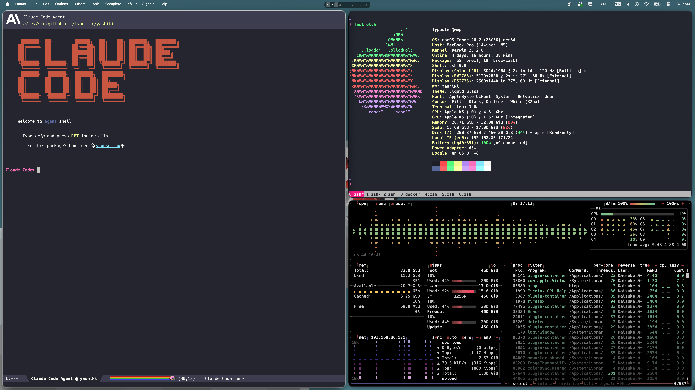

# Yashiki + SketchyBar Example (Menubar Overlay, Multi-Monitor)

A workspace indicator that overlays the macOS menu bar, supporting multiple displays with per-display tag indicators. Unfocused displays are shown dimmed.



For a simpler single-display example, see [sketchybar](../sketchybar/).

## Prerequisites

- [SketchyBar](https://github.com/FelixKratz/SketchyBar) (`brew install felixkratz/formulae/sketchybar`)
- [Hack Nerd Font](https://github.com/ryanoasis/nerd-fonts) (`brew install --cask font-hack-nerd-font`)
- [reap](https://github.com/typester/reap) (`brew install typester/tap/reap`)
- python3 (macOS built-in)
- yashiki running

## Usage

Add to your `~/.config/yashiki/init`:

```sh
yashiki exec --track "sketchybar -c path/to/examples/sketchybar-menubar/sketchybarrc"
```

This starts SketchyBar alongside yashiki and automatically terminates it on `yashiki quit`.

Or run standalone:

```sh
sketchybar -c path/to/examples/sketchybar-menubar/sketchybarrc
```

## Configuration

Edit the constants at the top of `plugins/yashiki_bridge.py` and the matching values in `sketchybarrc`:

| Variable | Default | Description |
|----------|---------|-------------|
| `MAX_DISPLAYS` | `3` | Maximum number of displays to support (must match `sketchybarrc`) |
| `NUM_TAGS` | `10` | Number of workspace tags (must match `sketchybarrc`) |
| `NOTCH_DISPLAY_ID` | `"1"` | Yashiki display ID of the notched display. Set to `None` for desktop Macs without a notch |

To find your display IDs, run `yashiki list-outputs`.

### Notch Display

The notched display's tags are positioned at the right end of the menu bar (between system tray and the notch). Other displays use center positioning. Set `NOTCH_DISPLAY_ID = None` if none of your displays have a notch.

## How It Works

### Architecture

```
yashiki subscribe --> yashiki_bridge.py --> sketchybar --set (direct updates)
```

Unlike the minimal example, this bridge directly updates SketchyBar item properties via `--set` commands instead of using event triggers.

1. **sketchybarrc** - Configures a 25px transparent overlay bar with per-display tag groups (brackets), starts the bridge via `reap`
2. **plugins/yashiki_bridge.py** - Subscribes to yashiki events, manages display slot assignment, and updates all SketchyBar items directly

### Multi-Monitor Support

The bridge maintains a **slot assignment** that maps yashiki display IDs to SketchyBar display slots (1-3). This mapping is independent of SketchyBar's internal arrangement IDs, so displays can be connected/disconnected without restarting SketchyBar.

- On display connect: new display is assigned the lowest free slot
- On display disconnect: slot is freed for reuse
- Each slot's click handler targets the correct yashiki display via `yashiki tag-view --output <display_id>`

### Tag States

| State | Focused Display | Unfocused Display |
|-------|----------------|-------------------|
| Active | Bright icon + background | Dimmed icon + background |
| Occupied | Bright icon | Dimmed icon |
| Vacant | Gray icon | Dark gray icon |

### Process Management

The bridge is started via [reap](https://github.com/nickolasburr/reap) with `--watch $PPID`, which automatically terminates the bridge when SketchyBar exits.

The bridge also kills any old instances of itself on startup to prevent duplicates.
